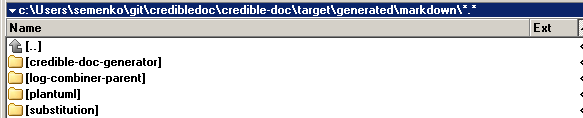

# Module `credible-doc-generator`
This module generates documentation for the
[credible-doc](../README.md) repository modules.
This document is also generated by this `credible-doc-generator` module.

## Usage
Please open the command line and try next commands in a temporary folder.

Clone this repository from Github

    git clone https://github.com/credibledoc/credible-doc.git
    
Build projects and install artifacts by Maven
    
    mvn clean install -f credible-doc/pom.xml

Change the directory
    
    cd credible-doc
    
Launch the application

    java -jar credible-doc-generator/target/&&beginPlaceholder {
           "className": "com.credibledoc.substitution.content.generator.jar.LocalJarNameContentGenerator",
           "description": "Current name of the credible-doc-generator-X.X.X.jar.",
                  "parameters": {
                      "targetDirectoryRelativePath": "credible-doc-generator/target",
                      "jarNamePrefix": "credible-doc-generator-"
                  }
       } &&endPlaceholder

As a result, the `credible-doc/target/generated/markdown/` folder with new sub-folders and files are generated.

This folder should look as the following one

Please inspect these generated files in the `credible-doc/target/generated/doc` folder.
These generated files are the part of the documentation you currently reading. You can use
this approach for the generation of the documentation for your own projects.

## The templates used for the generation of this documentation
This documentation generated from these templates:

&&beginPlaceholder {
    "className": "com.credibledoc.substitution.content.generator.resource.ResourcesListMarkdownGenerator",
    "description": "List of templates used for the documentation.",
    "parameters": {"endsWith": ".md"}
} &&endPlaceholder

As you can notice, this generated document and its template have the common parts,
and this diff shows the different parts. These different parts are displayed on the left side of the picture
and the content generated from these placeholders is displayed on the right side of it.

## Examples of PlantUML diagrams

The [diagrams.md](doc/diagrams.md) page shows some examples of PlantUML diagrams
generated from the log files.
