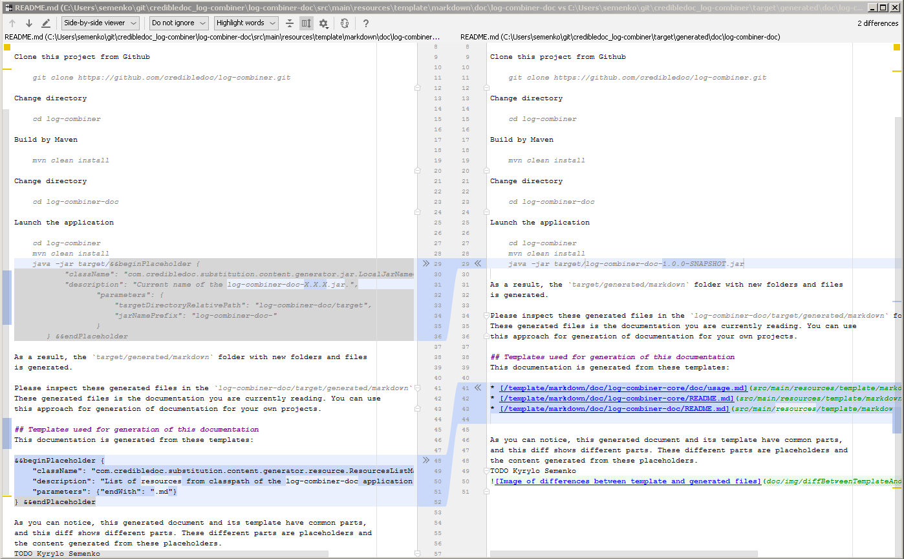

# Module log-combiner-doc
This module generates a documentation for the
[log-combiner-parent](../README.md) modules.
This document is also generated by this `log-combiner-doc` module.

## Usage
Please open a command line and try the next commands in a temporary folder.

Clone this repository from Github

    git clone https://github.com/credibledoc/credible-doc.git
    
Build projects and install artifacts by Maven
    
    mvn clean install -f credible-doc/pom.xml

Change directory
    
    cd credible-doc/log-combiner-parent
    
Launch the application

    java -jar log-combiner-doc/target/&&beginPlaceholder {
           "className": "com.credibledoc.substitution.content.generator.jar.LocalJarNameContentGenerator",
           "description": "Current name of the log-combiner-doc-X.X.X.jar.",
                  "parameters": {
                      "targetDirectoryRelativePath": "log-combiner-doc/target",
                      "jarNamePrefix": "log-combiner-doc-"
                  }
       } &&endPlaceholder

As a result, the `credible-doc/log-combiner-parent/target/generated/doc` folder with new folders and files
is generated.

Please inspect these generated files in the `credible-doc/log-combiner-parent/target/generated/doc` folder.
These generated files is the documentation you currently reading. You can use
this approach for generation of documentation for your own projects.

## Templates used for generation of this documentation
This documentation is generated from these templates:

&&beginPlaceholder {
    "className": "com.credibledoc.substitution.content.generator.resource.ResourcesListMarkdownGenerator",
    "description": "List of resources from classpath of the log-combiner-doc application.",
    "parameters": {"endWith": ".md"}
} &&endPlaceholder

As you can notice, this generated document and its template have common parts,
and this diff shows different parts. These different parts are placeholders (at the left side)
and the content generated from these placeholders (at the right side).

